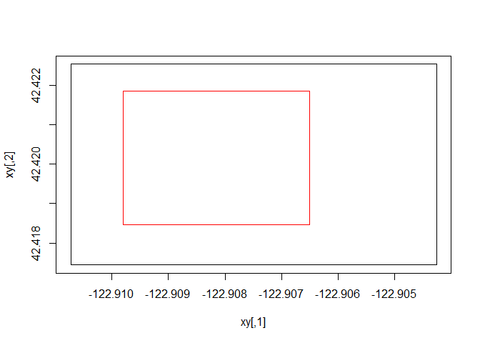
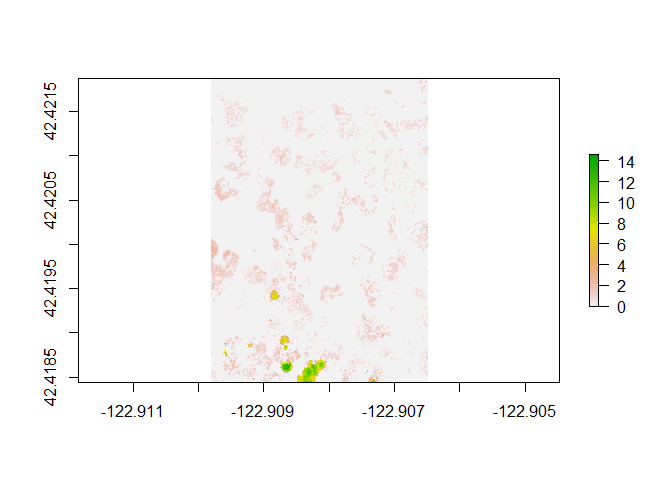
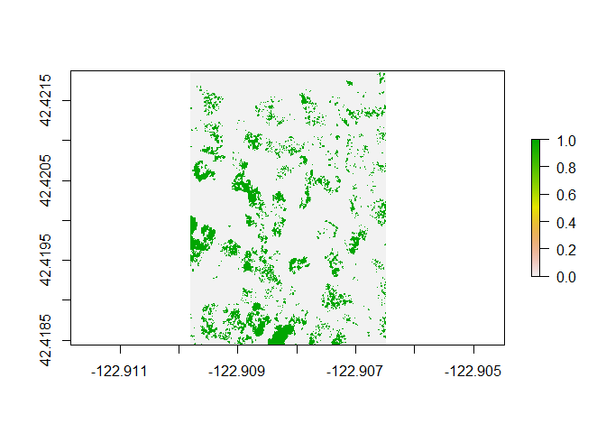
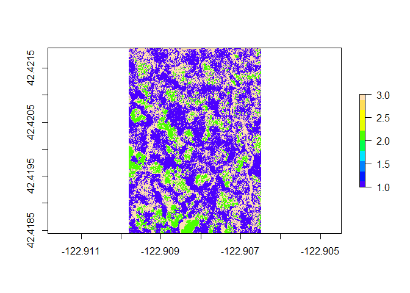
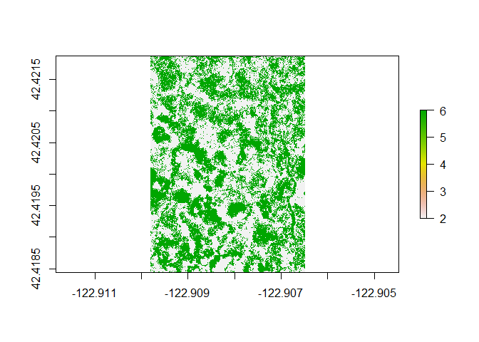
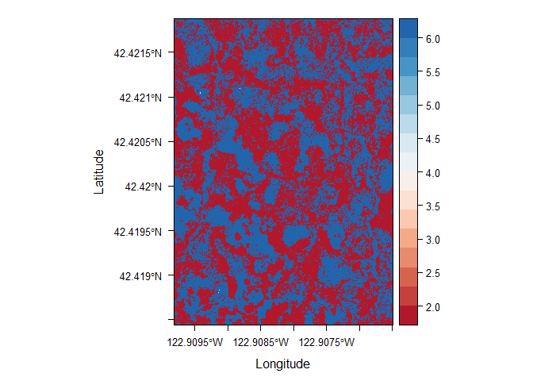
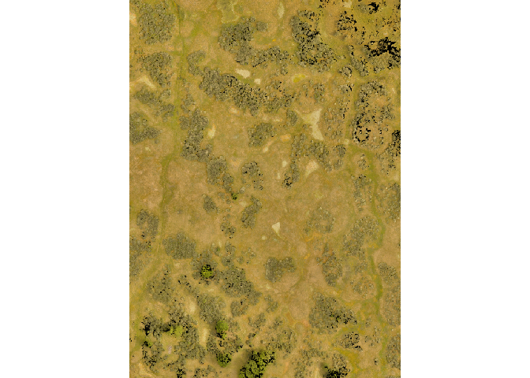
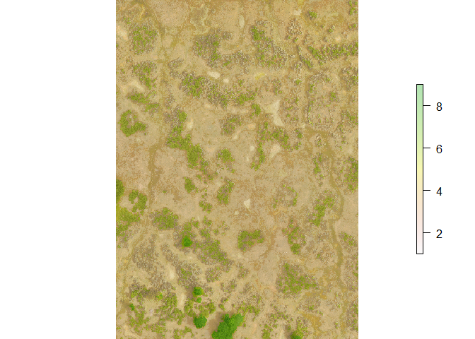
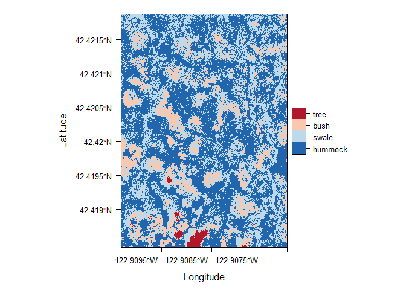
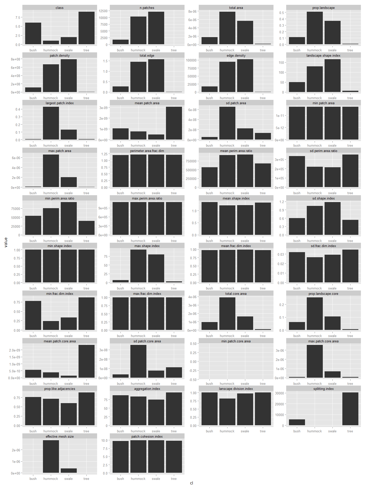

# Habitat Classification and Resistance Surfaces using Unmanned Aerial Vehicles
Ben Weinstein  
July 2, 2015  


```r
library(raster)
library(maptools)
library(ggplot2)
library(plyr)
library(reshape2)
library(rgdal)
library(plotKML)
library(rgeos)
library(gdistance)
library(SDMTools)
library(rasterVis)

#set dropbox path
droppath<-"C:/Users/Ben/Dropbox/"
```

#Preprocessing
* The data was collected using a Phantom Vision 2+ drone that was shot in manual flight. The photos were shot in RAW and batch transformed to .tif in Photoshop.

If we are thinking about a paper, figure 1 might be a cartoon depiction of each individual step in the process going from right to left, above the step is the goal of the step, and below is the software used with some parameter settings.

To this end, we really need to settle on a fully automated way to do all of this, it can't be unclear what we did/why we did it/how we'd redo it. If the goal of the paper is to demystify some of the drone work, it needs to abundantly clear how we made it to each step. Right now i'm using a dem from one run, and a spectral reading from another, in different projections, with coordinates shot in different projections. 

* An orthomosiac was created in Agisoft which produced a .tif of three bands, and a DEM. The origin of the DEM remains a mystery to me.

#Goals

* To read in the points
* Classify the habitat using kmeans unsupervised classifcation
* Use the ground truth data to check classification accuracy.

##Read in GPS points


```r
#Georeferenced points relating to the classes
pt<-readGPX(paste(droppath,"Droning/PamGPSExtract20150701_2.gpx",sep="/"))
head(pt$waypoints)
```

```
##         lon      lat     ele                 time name                 cmt
## 1 -122.9061 42.42190 376.719 2015-04-11T20:21:03Z  432 11-APR-15 1:21:03PM
## 2 -122.9062 42.42188 377.681 2015-04-11T20:20:49Z  431 11-APR-15 1:20:49PM
## 3 -122.9062 42.42187 376.960 2015-04-11T20:20:32Z  430 11-APR-15 1:20:32PM
## 4 -122.9062 42.42187 376.719 2015-04-11T20:20:28Z  429 11-APR-15 1:20:28PM
## 5 -122.9069 42.42189 376.719 2015-04-11T20:18:39Z  428 11-APR-15 1:18:39PM
## 6 -122.9078 42.42177 375.518 2015-04-11T20:16:33Z  427 11-APR-15 1:16:33PM
##          sym      type extensions
## 1 Flag, Blue Blue Flag  432\nbold
## 2 Flag, Blue Blue Flag  431\nbold
## 3 Flag, Blue Blue Flag  430\nbold
## 4 Flag, Blue Blue Flag  429\nbold
## 5 Flag, Blue Blue Flag  428\nbold
## 6 Flag, Blue Blue Flag  427\nbold
```

The key here is the lon, lat, ele and name, which will match the waypoint ID

## Read in point classification

Pam was in the field and recorded the habitat class of each point


```r
cl<-read.csv(paste(droppath,"Droning/Whetstone_groundtruth_landscapefeatures3.csv",sep="/"))

#merge with the gpx data
pts<-merge(x=pt$waypoints,y=cl,by.x="name",by.y="Waypoint")
```

How many points in each class?


```r
table(pts$Landscape.class)
```

```
## 
##   bush  hummock   swale    tree 
##      37      22      72      10
```

```r
#Turn into spatial class
pts<-SpatialPointsDataFrame(cbind(pts$lon,pts$lat),pts)
projection(pts)<-CRS("+proj=longlat +datum=WGS84")
```

##Read in the spectral raster 
crop by extent of points

```r
r1<-brick("C:/Users/Ben/Dropbox/Droning/20150425_Run4_NAD83UTM10N.tif")
```

reproject points to UTM

```r
rpts<-spTransform(pts,CRS(projection(r1)))
e<-extent(rpts)
```

Crop raster to points

```r
plot(extent(r1))
plot(extent(e),col='red',add=T)
```

 

```r
rcrop<-crop(x=r1,y=e*1.01)
```

##read in DEM


```r
#clip by the spatial extent of the points.
d<-raster(paste(droppath,"Droning/AgisoftFull20150425_Run3_DEM.tif",sep="/"))

#reproject
dpr<-projectRaster(d,rcrop)

#crop
dcrop<-crop(dpr,extent(rcrop))
names(dcrop)<-c("DEM")

#remove negative elevation?
dcrop[dcrop<0]<-0
plot(dcrop)
```

 

###Overlay points 
As you can see, the points don't quite match yet. Brendan and Pam are checking on the georeferencing of the drone layer. We can continue with the habitat classifcation and wait to test the accuracy of the results.


```r
plot(rcrop)
points(pts,col=pts$Landscape.class,pch=16,cex=1.5)
```

 

##Extract points from the raster


```r
names(rcrop)<-c("Band1","Band2","Band3","Band4")
vals<-extract(x=rcrop[[1:3]],y=pts,sp=T,buffer=2,fun=mean)
```

Let's learn about the values


```r
mvals<-melt(vals@data,measure.vars=c("Band1","Band2","Band3"))
ggplot(mvals,aes(x=Landscape.class,y=value,col=variable)) + geom_boxplot() + theme_bw()
```

 

Do we need to resample the dem to fit the resolution of the spectral?

##Unsupervised classifcation

The points are not aligning to our expectation of the classes. Let's have the computer decided the best differentation of the top 4 classes and then assign names to each?

Unsupervised classication is done through kmeans clustering, where we supply the known number of clusters. K-means clustering aims to partition n observations into k clusters in which each observation belongs to the cluster with the nearest mean, serving as a prototype of the cluster. The process is done iteratively, starting with random centers and comparing the fit of each solution.

Give the relative hetergenity of the system, we can aggregate cells and make this slightly less computationally exhausting. 

##SPECTRAL

```r
ragg<-aggregate(rcrop,30)
```

##DEM

Make DEM into the same dimension as the aggregated spectral.


```r
fact<-res(ragg)/res(dcrop)
#fact=50
#round to 3 decimnal places, we will need to enforce the same size
dagg<-aggregate(dcrop,fact=fact)
plot(dagg)
```

 

```r
#there can be rounding errors, enforce the same extent
extent(dagg)<-extent(ragg)
```

#Create habitat classification
##Two Stage process - DEM then Spectral

Use the dem to classify the trees and the bushes, but then use the spectral to classify the swale and hummock. To do this we need everything to have the same spatial resolution

* Classify into 3 the dem aggregate raster


```r
#3 classes
dagg[is.na(dagg[])]<-0
cl<-kmeans(x=dagg[],centers=3,iter.max=100,nstart=3)
kmeansDagg<-raster(dagg)
kmeansDagg[]<-cl$cluster
plot(kmeansDagg,col=topo.colors(10))
points(rpts,col=rpts$Landscape.class,pch=16,cex=.8)
text(rpts,labels=rpts$Landscape.class,pch=16,cex=.7)
```

 

Get the portions of the aggregated spectral raster, where the classified aggregated dem raster is not bushes or trees.


```r
#hard code a value in there, ordinal scale changes.
v=extract(kmeansDagg,cbind(x=507579.1,y=4696391))
#make a copy
kmeancopy<-kmeansDagg
kmeancopy[!kmeancopy==v]<-NA
spectralnobush<-mask(ragg,kmeancopy)
plot(spectralnobush)
```

 

Classify the resulting raster, between types.


```r
spectralnobush[is.na(spectralnobush)]<-0
cl<-kmeans(x=spectralnobush[[1:3]][],centers=3,iter.max=100,nstart=3)
kmeansspectralnobush<-raster(spectralnobush)
kmeansspectralnobush[]<-cl$cluster
plot(kmeansspectralnobush,col=topo.colors(10))
```

 

Combine the spectral class with the dem classification


```r
combo<-kmeansspectralnobush* kmeansDagg
unique(combo)
```

```
## [1] 1 2 3 4 6
```

```r
plot(combo)
```

 

```r
levelplot(combo,margin=F)
```

 

```r
plotRGB(ragg)
```

 

##Overlay on image

```r
plotRGB(ragg)
plot(combo,alpha=.5,add=T)
```

 

1 is Bush
2 is Tree
6 is Hummock
9 is Swale

The remaining question is whether the delinaiation of swale is accurate and fits out expectation surrounding the bushes. If look at the rim of the bushes, you see a kind of swale halo that matches the classification of the river of swale. we need to be sure that fits monica's expectation for the genetic sampling so we have the same terminology!

### Landscape ecology metrics

The field of landscape ecology has thought alot about the permiability of matrices.
We can measure fragmentation, size, area, shape, etc. For example for each of our classes (bush,swale,hummock,tree = 1,2,3,4)


```r
stats<-ClassStat(kmeansDagg,res(kmeansDagg)[1])
stats<-melt(stats,id.vars="class")
ggplot(stats,aes(x=class,y=value)) + geom_bar(stat="identity") + facet_wrap(~variable,scales="free",ncol=4)
```

 

#Computing geographic distances

Create a matric of euclidean distance


```r
geo<-pointDistance(rpts,rpts,lonlat=T,allpairs = T)
```

So for example if you wanted the geographic distance between the 2nd and 32nd point. Calculated in meters.


```r
geo[2,32]
```

```
## [1] 3973944
```

```r
plot(kmeansDagg)
points(rpts[c(2,32),],col='black',pch=16,cex=2)
lines(coordinates(rpts[c(2,32),]),lwd=3)
```

 

Average distance between points


```r
ggplot(melt(geo),aes(x=value)) + geom_histogram() + theme_bw() + labs(x="Distance between points")
```

```
## stat_bin: binwidth defaulted to range/30. Use 'binwidth = x' to adjust this.
```

 

#Computing resistance distance

A resistance distance considers the acrued frictional cost of moving between points. 

* Create a resistance surface from our habitat class
* Calculate least cost path between points.

There are an enormous number of variations here, but they are all on the same basic principle. Studies comparing methods mostly end up with the generic, 'depends on your question' and no clear recommendation for when to use least-cost, resistance, circuit theory etc. 

Much, much more important than the algorithmic approach is the biological basis of the frictional cost. In our case, the general explanation is that crossing patches is more costly than staying within a path. 

**Questions to ponder**
Do we want all habitats to present the same barrier? Is it a linear function of habitat? Or does the edge of the habitat present a barrier that is slightly permeable, but the center of a patch is basically impermeable. Does path size matter? There are alot of variations here, and i must admit that i have always been unsure of the validity of comparing costs. More, what i've done in the past if to think of them as unitless surfaces and just order them as a 'more costly path' versus a 'less costly path'. 

Okay, enough with the diatribe, here's how you do it using the package gdistance:

## Create a resistance surfarce


```r
tr<-transition(kmeansDagg,mean,directions = 8)
#Computing least cost path
```

##Calculate least cost path between points.
